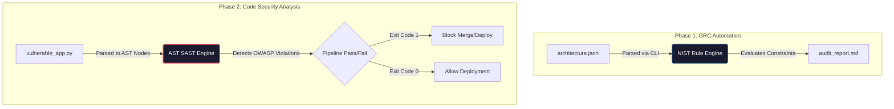

# 🛡️ AI SecGuard: Enterprise NIST & SAST Engine

[](https://www.python.org/)
[](https://opensource.org/licenses/MIT)
[](#)
[](#)

> **Deterministic, zero-dependency DevSecOps toolkit** featuring a "Compliance-as-Code" mapper for the NIST AI RMF and a mathematical Abstract Syntax Tree (AST) scanner to prevent OWASP Top 10 for LLMs.

---

## ⚡ The Challenge: AI Speed vs. Security Lag

As enterprises rapidly deploy autonomous AI agents (LangChain, AutoGen) and LLMs, manual security audits create severe production bottlenecks and expose organizations to regulatory fines under the **EU AI Act**. 

Traditional text-based security scanners (Regex) are **context-blind**. They fail to understand execution flow, variable scoping, or the complex data-flows of modern AI-generated code, resulting in high false-positive rates and missed critical vulnerabilities.

---

## 🚀 The Solution: Dual-Engine DevSecOps Framework

AI SecGuard provides a supply-chain-hardened, dual-engine security toolkit engineered to drop directly into enterprise CI/CD pipelines with **O(n) traversal complexity** and zero external dependencies.

1. **Governance-as-Code (CLI)**: Parses AI architecture metadata and dynamically generates executive-ready audit reports mapped to the **NIST AI Risk Management Framework**.
2. **Mathematical AST Scanner (SAST)**: A custom-built Static Application Security Testing engine that compiles Python source code into an Abstract Syntax Tree (AST) to *mathematically* detect hardcoded credentials and dangerous execution paths (e.g., `eval()`, `exec()`) before runtime.

---

## 🏗️ System Architecture



---

## 💻 Engine 1: Mathematical AST Security Scanner (SAST)

Instead of brittle regex string matching, this engine leverages Python's native `ast` library to build a syntax tree, enabling **context-aware, deterministic analysis** of execution paths.

### 🔍 Example Vulnerable Code (`vulnerable_app.py`)
```python
import os

# Vulnerability 1: Hardcoded Secret (AST Assign Node with Str value)
LLM_API_KEY = "sk-1234567890abcdef" 

def process_user_prompt(user_input):
    # Vulnerability 2: Insecure Output Handling (AST Call Node with 'eval')
    # OWASP LLM04: Model Denial of Service / Code Injection
    result = eval(user_input) 
    return result
```

### ⚙️ Execution Command
```bash
python sast_engine.py vulnerable_app.py
```

### 📊 Sample Detection Output
```text
==================================================
🔍 INITIALIZING AST SECURITY SCANNER (v1.0.0)
==================================================
[*] Scanning vulnerable_app.py...
[*] Building Abstract Syntax Tree...
[!] Scan Complete. Found 2 severe vulnerabilities:

 -> Line 4 | Hardcoded Secret Detected (CRITICAL)
    Details: Sensitive data assigned to 'LLM_API_KEY' in plaintext.
    Remediation: Use environment variables (os.getenv) or a secrets manager.

 -> Line 9 | Insecure Output Handling - OWASP LLM04 (CRITICAL)
    Details: Dangerous use of eval(). Never pass untrusted LLM output directly to execution functions.
    Remediation: Use ast.literal_eval() or strict JSON schema validation.
==================================================
```

---

## 📊 Engine 2: NIST AI Compliance Mapper

Automates the generation of GRC documentation. Feeds architectural metadata into a deterministic rule engine to instantly output remediation steps for compliance blindspots.

### ⚙️ Execution Command
```bash
python nist_mapper.py --config architecture.json --output audit_report.md
```

### 📜 Supported Regulatory Frameworks
- **NIST AI 100-1**: Artificial Intelligence Risk Management Framework (Map, Measure, Manage, Govern).
- **OWASP Top 10 for LLMs**: Specifically targeting **LLM02** (Insecure Output Handling) and **LLM04** (Model Denial of Service).
- **EU AI Act**: Data privacy, PII scrubbing enforcement, and localized model hosting constraints.

---

## 🔧 Installation & CI/CD Integration

**Zero external dependencies required.** Built with 100% standard Python libraries (`ast`, `json`, `argparse`, `sys`) to ensure seamless, air-gapped integration into heavily restricted enterprise environments.

```bash
git clone https://github.com/YOUR_USERNAME/ai-secguard.git
cd ai-secguard
```

### 🔄 GitHub Actions Integration
Designed to fail CI/CD builds (`sys.exit(1)`) when OWASP vulnerabilities are mathematically proven in the AST structure. Add this to `.github/workflows/security-scan.yml`:

```yaml
name: AI SecGuard SAST Scan
on: [push, pull_request]

jobs:
  security-scan:
    runs-on: ubuntu-latest
    steps:
      - name: Checkout Code
        uses: actions/checkout@v4

      - name: Set up Python
        uses: actions/setup-python@v4
        with:
          python-version: '3.10'

      - name: Run AST SAST Engine
        run: |
          python sast_engine.py ./src/
          # Engine will automatically exit with code 1 if vulnerabilities are found, failing the build.
```

---

## 🛡️ Security & Threat Model

- **Supply Chain Hardened**: Zero third-party `pip` dependencies eliminate the risk of malicious package injection (e.g., typosquatting).
- **Deterministic Execution**: AST traversal guarantees consistent results across runs; no probabilistic hallucinations.
- **Air-Gapped Ready**: Can be executed in offline, high-security environments without internet access.

---

## 🤝 Contributing

Contributions are welcome! Please read our [Contributing Guidelines](CONTRIBUTING.md) and submit a Pull Request. For major changes, please open an issue first to discuss what you would like to change.

## 📄 License

This project is licensed under the MIT License - see the [LICENSE](LICENSE) file for details.

---
*Developed for Enterprise DevSecOps, GRC Automation, and Secure AI Agent Deployment.*
